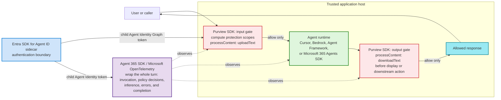

# Agnostic Agent + Entra Agent ID + M365 Agents + Agent365 + Purview Template

This is a **beginner template** showing where to interject **Agent365 SDK** and **Purview API** calls in either:
- **Microsoft Agent Framework** (`microsoft/agent-framework`)
- **Microsoft 365 Agents SDK** (`microsoft/agents`)
- **Amazon Bedrock** direct model inference (`Converse`)
- **Amazon Bedrock AgentCore Runtime** with passwordless Entra Agent ID federation
- **Cursor SDK** local orchestration with mandatory Purview gates

You can keep one policy + reporting pattern, then swap host SDKs.

The language-neutral examples call the **Microsoft Entra Agent ID auth
sidecar** over localhost. The separate AgentCore template uses its AWS Runtime
execution role and does not use the local sidecar.

You get both:
- JavaScript examples in `src/`
- Python examples in `python/`
- C++ examples in `cpp/`
- C#/.NET examples in `dotnet/`
- Rust examples in `rust/`
- Go examples in `go/`
- A complete TypeScript Cursor SDK example in `cursor/`

## Prerequisites

### Microsoft 365 / Entra / Purview prerequisites

1. A Microsoft Entra tenant and an app registration for your agent host.
2. An Agent ID blueprint, blueprint principal, and individual agent identity.
3. A local-development client secret on the blueprint. Use workload identity or a certificate in production.
4. Microsoft Purview enabled in that tenant.
5. Graph permissions for Purview API flows (for example `Content.Process.User` and `ProtectionScopes.Compute.User`) granted to the agent identity.
6. A Purview DLP policy scoped to your app registration (`Application` enforcement plane).
7. If using the included policy script template, prerequisites from the Purview sample:
   - PowerShell 7+
   - ExchangeOnlineManagement module
   - A role that can manage Purview DLP (for example Compliance Administrator)

### Local developer prerequisites

| Language template | Required toolchain |
|---|---|
| JavaScript (`src/`) | Node.js 20+ |
| Python (`python/`) | Python 3.10+ |
| C++ (`cpp/`) | C++17 compiler |
| C#/.NET (`dotnet/`) | .NET SDK 8.0+ |
| Rust (`rust/`) | Rust stable toolchain (`cargo`) |
| Go (`go/`) | Go 1.22+ |
| Amazon Bedrock (`src/`) | Node.js 20+, AWS SDK credentials, Bedrock model access |
| Amazon Bedrock AgentCore (`bedrock/agentcore/`) | Python, AgentCore CLI, authenticated AWS deployment access |
| Cursor (`cursor/`) | Node.js 22.13+, Cursor API key |
| Entra sidecar | Docker Desktop with Compose v2 |

## One-time setup for all templates

1. From `template/`, create env file:
   ```bash
   cp .env.example .env
   cp entra-sidecar/.env.example entra-sidecar/.env
   ```
2. Fill `TENANT_ID`, `BLUEPRINT_APP_ID`, and `BLUEPRINT_CLIENT_SECRET` in `entra-sidecar/.env`. Fill `AGENT_CLIENT_ID` in the application `.env`.
3. Start and verify the sidecar:
   ```bash
   docker compose --env-file entra-sidecar/.env -f entra-sidecar/docker-compose.yml up -d
   curl --fail http://localhost:5000/healthz
   ```
4. Fill the remaining placeholders in `.env` (app IDs, endpoints, and runtime settings).
5. Choose host SDK in `.env`:
   - `HOST_SDK=agent-framework`
   - `HOST_SDK=m365-agents-sdk`
   - `HOST_SDK=bedrock`
6. Keep Purview IDs aligned:
   - `.env` → `PURVIEW_APP_LOCATION_ID`
   - `purview/Create-DlpPolicyForCustomAIApps.template.ps1` → `$Applications`
7. Replace TODOs for:
   - Agent365 reporting adapter calls
   - host-specific wiring adapters

For a full explanation, PowerShell commands, autonomous/OBO use cases, production guidance, and troubleshooting, read [`entra-sidecar/README.md`](entra-sidecar/README.md).

If AWS will host the agent in AgentCore Runtime, skip the local sidecar setup
for that deployment and follow
[`bedrock/agentcore/README.md`](bedrock/agentcore/README.md).

For a ready-to-run Cursor host that already uses the current Agent 365
OpenTelemetry package and enforces Purview before and after every Cursor run,
follow [`cursor/README.md`](cursor/README.md).

## Beginner mental model (simple)

Think of each message as a pipeline:
1. user sends text
2. app asks the Entra sidecar for the agent's Graph authorization header
3. Purview checks if policy allows the input
4. model runs (if allowed)
5. Purview checks model response
6. app returns or blocks response
7. Agent365 logs what happened

### SDK insertion-point diagram



The diagram's editable source is
[`diagrams/sdk-insertion-points.excalidraw`](diagrams/sdk-insertion-points.excalidraw).
Open it with the Microsoft internal Excalidraw instance at
[aka.ms/excalidraw](https://aka.ms/excalidraw).

## Where each integration happens

1. **Entra SDK for Agent ID: authentication boundary**
   - run the sidecar beside the trusted application host, not inside the model
   - request a child Agent Identity token immediately before calling Purview or exporting Agent 365 telemetry
   - keep Blueprint credentials in the sidecar only
2. **Purview SDK/API: before model execution**
   - `computeProtectionScopes` for the current user
   - `processContent` with `uploadText`
   - block if policy requires it
3. **Purview SDK/API: after model execution**
   - buffer the complete response, then call `processContent` with `downloadText`
   - block/redact if policy requires it
   - do not display, stream, execute, or forward unapproved output
4. **Agent 365 SDK: around the complete turn**
   - initialize Microsoft OpenTelemetry when the trusted host starts
   - create invocation, guardrail, inference, error, and completion spans
   - record content only after the corresponding Purview gate allows it

## Which host SDK am I using?

Set `HOST_SDK` in `.env`:
- `agent-framework`
- `m365-agents-sdk`
- `bedrock`

Then wire the matching adapter in `src/framework/hostAdapters.js`.
For Python, wire it in `python/host_adapters.py`.
For C++, wire it in `cpp/src/host_adapters.cpp`.
For C#/.NET, wire it in `dotnet/HostAdapters.cs`.
For Rust, wire it in `rust/src/host_adapters.rs`.
For Go, wire it in `go/host_adapters.go`.

## Files to edit first (in order)

- `entra-sidecar/README.md`
  - create the tenant objects, set unique environment values, and choose autonomous or OBO
- `src/integrations/agent365Adapter.js`
 - replace TODO stubs with official Agent365 SDK calls for reporting
- `src/integrations/purviewAdapter.js`
 - uses the Entra sidecar for Graph authorization
 - adapt response parser in `getEnforcementDecision`
- `src/framework/hostAdapters.js`
 - replace placeholders with your real host runtime objects/handlers
- `.env.example`
 - copy to `.env` and fill all IDs/secrets/endpoints
- If using Python first, start with:
 - `python/agent365_adapter.py`
 - `python/purview_adapter.py`
 - `python/host_adapters.py`
- If using C++ first, start with:
 - `cpp/src/agent365_adapter.cpp`
 - `cpp/src/purview_adapter.cpp`
 - `cpp/src/host_adapters.cpp`
- If using C#/.NET first, start with:
 - `dotnet/Agent365Adapter.cs`
 - `dotnet/PurviewAdapter.cs`
 - `dotnet/HostAdapters.cs`
- If using Rust first, start with:
 - `rust/src/agent365_adapter.rs`
 - `rust/src/purview_adapter.rs`
 - `rust/src/host_adapters.rs`
- If using Go first, start with:
 - `go/agent365_adapter.go`
 - `go/purview_adapter.go`
 - `go/host_adapters.go`

## Mandatory placeholders to fill

| Placeholder | Purpose |
|---|---|
| `TENANT_ID` | Microsoft Entra tenant hosting app + policies |
| `BLUEPRINT_APP_ID` | Agent ID blueprint application client ID; sidecar `.env` only |
| `BLUEPRINT_CLIENT_SECRET` | local development credential; sidecar `.env` only |
| `AGENT_CLIENT_ID` | individual agent identity client ID |
| `ENTRA_SIDECAR_AUTH_MODE` | `autonomous` or `obo` |
| Current request `Authorization` header | pass through `TurnContext` for OBO only; never store it in `.env` |
| `HOST_SDK` | choose `agent-framework`, `m365-agents-sdk`, or `bedrock` |
| `M365_AGENTS_BOT_APP_ID` / `M365_AGENTS_BOT_APP_PASSWORD` | Microsoft 365 Agents SDK app credentials |
| `PURVIEW_APP_LOCATION_ID` | Entra app registration ID used in DLP `Application` location |
| `AGENT365_APP_ID` / `AGENT365_APP_SECRET` | Agent365 SDK app credentials |
| `AGENT365_REPORTING_ENDPOINT` | destination for Agent365 reporting/telemetry |
| `GRAPH_ACCESS_TOKEN_PLACEHOLDER` | manual fallback used only when the sidecar is disabled |

## Purview policy bootstrap

Use `purview/Create-DlpPolicyForCustomAIApps.template.ps1` as a starter to create/update tenant DLP rules for your app registrations.

## Setup and run each template

### JavaScript

```bash
cd template
node --env-file=.env ./src/exampleRunner.js
```

Edit first:
- `src/integrations/agent365Adapter.js`
- `src/integrations/purviewAdapter.js`
- `src/framework/hostAdapters.js`

### Python

```bash
cd template
set -a && source .env && set +a
python3 python/example_runner.py
```

Edit first:
- `python/agent365_adapter.py`
- `python/purview_adapter.py`
- `python/host_adapters.py`

### C++

```bash
cd template
set -a && source .env && set +a
cmake -S cpp -B cpp/build
cmake --build cpp/build
./cpp/build/example_runner
```

Edit first:
- `cpp/src/agent365_adapter.cpp`
- `cpp/src/purview_adapter.cpp`
- `cpp/src/host_adapters.cpp`

### C#/.NET

```bash
cd template
set -a && source .env && set +a
dotnet run --project ./dotnet/AgnosticAgentTemplate.csproj
```

Edit first:
- `dotnet/Agent365Adapter.cs`
- `dotnet/PurviewAdapter.cs`
- `dotnet/HostAdapters.cs`

### Rust

```bash
cd template
set -a && source .env && set +a
cargo run --manifest-path ./rust/Cargo.toml
```

Edit first:
- `rust/src/agent365_adapter.rs`
- `rust/src/purview_adapter.rs`
- `rust/src/host_adapters.rs`

### Go

```bash
cd template
set -a && source .env && set +a
cd go
go run .
```

Edit first:
- `go/agent365_adapter.go`
- `go/purview_adapter.go`
- `go/host_adapters.go`

If you use another runtime, keep the same middleware order and only replace runtime-specific wiring.

## Amazon Bedrock

For direct `Converse` model inference plus Agent 365 and Purview guidance, see
[`bedrock/README.md`](bedrock/README.md).

For an AgentCore-hosted Python agent with passwordless federation from the
Runtime execution role to Entra Agent ID, see
[`bedrock/agentcore/README.md`](bedrock/agentcore/README.md).
