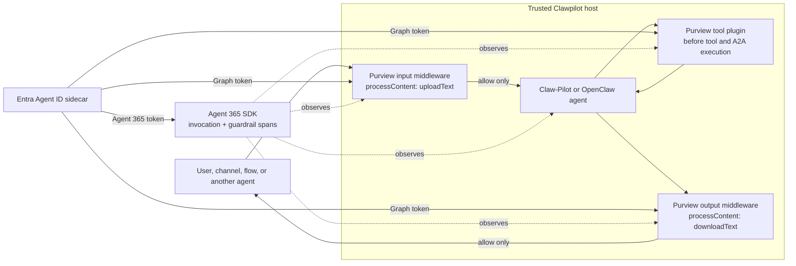

# Governed Clawpilot agent template

This template adds three Microsoft controls to Clawpilot-style agents:

1. **Microsoft Entra Agent ID sidecar** supplies short-lived child Agent
   Identity tokens. Blueprint credentials stay in the sidecar.
2. **Microsoft Purview** evaluates inbound messages, complete outbound
   responses, tool arguments, and agent-to-agent payloads.
3. **Agent 365 SDK** exports invocation and guardrail telemetry through the
   Microsoft OpenTelemetry distribution.

The examples support two different projects that share the Clawpilot name:

| Project | What this template provides |
|---|---|
| [`swoelffel/claw-pilot`](https://github.com/swoelffel/claw-pilot) | Trusted runtime middleware and a decision-aware tool plugin |
| [`kcchien/clawpilot`](https://github.com/kcchien/clawpilot) | Agent Skill installation plus a secure OpenClaw baseline |

These are intentionally separate. The `kcchien/clawpilot` skill teaches an
agent how to configure OpenClaw, but a `SKILL.md` file is **not** a security
boundary. Put Entra, Purview, and Agent 365 code in the trusted gateway or
runtime that invokes OpenClaw.

## Architecture and SDK insertion points



The model cannot bypass these checks because they run in the host process.
Do not put credentials, token acquisition, or allow/block logic in an agent
prompt, workspace file, or Agent Skill.

## What each file does

| File | Purpose |
|---|---|
| `.env.example` | Every tenant-specific value a beginner must replace |
| `src/entra-sidecar.ts` | Gets a child Agent Identity token from the local sidecar |
| `src/purview-client.ts` | Calls `protectionScopes/compute` and `processContent` |
| `src/agent365-observability.ts` | Initializes Agent 365 and records invocation/guardrail spans |
| `src/clawpilot-governance.ts` | Fail-closed message middleware and tool/A2A plugin |
| `integration/register-governance.ts` | Copy-paste bootstrap for `swoelffel/claw-pilot` |
| `integration/openclaw.config.json5` | Beginner-safe OpenClaw agent configuration |

## Prerequisites

1. Node.js 22.12 or newer.
2. A Microsoft Entra Agent ID blueprint and child Agent Identity.
3. The local sidecar from [`../entra-sidecar/`](../entra-sidecar/).
4. Microsoft Graph permissions required by your Purview deployment, including
   `Content.Process.User` and `ProtectionScopes.Compute.User`.
5. A Purview DLP policy whose application list contains
   `PURVIEW_APP_LOCATION_ID`.

Use certificate or workload identity credentials in production. The client
secret in the sidecar template is only for local development.

## Verify the standalone template first

From this directory:

```bash
cp .env.example .env
npm install
npm run build
npm test
```

The tests use fake policy decisions; they do not call your tenant.

## Option A: add it to `swoelffel/claw-pilot`

This is the full orchestrator integration. Claw-Pilot currently provides:

- middleware before and after its prompt loop;
- `tool.beforeCall`, which can return `allow`, `deny`, `modify-args`, or
  `require-approval`;
- tool hooks that also cover `send_message`/agent-to-agent tools.

### 1. Clone both repositories

```bash
git clone https://github.com/swoelffel/claw-pilot.git
cd claw-pilot
pnpm install
```

Keep this template repository available in another folder.

### 2. Copy the governance implementation

Run these commands from the Claw-Pilot clone. Replace
`<PATH_TO_SDK_TEMPLATE>` with the folder containing this repository.

```bash
mkdir -p src/integrations/microsoft-governance
cp -R <PATH_TO_SDK_TEMPLATE>/template/clawpilot/src/. \
  src/integrations/microsoft-governance/
cp <PATH_TO_SDK_TEMPLATE>/template/clawpilot/integration/register-governance.ts \
  src/integrations/register-microsoft-governance.ts
cp <PATH_TO_SDK_TEMPLATE>/template/clawpilot/.env.example .env
```

Windows PowerShell:

```powershell
New-Item -ItemType Directory -Force src\integrations\microsoft-governance
Copy-Item <PATH_TO_SDK_TEMPLATE>\template\clawpilot\src\* `
  src\integrations\microsoft-governance -Recurse
Copy-Item <PATH_TO_SDK_TEMPLATE>\template\clawpilot\integration\register-governance.ts `
  src\integrations\register-microsoft-governance.ts
Copy-Item <PATH_TO_SDK_TEMPLATE>\template\clawpilot\.env.example .env
```

### 3. Add the Microsoft packages

```bash
pnpm add @microsoft/opentelemetry @opentelemetry/resources
```

### 4. Register in every runtime process

Claw-Pilot's dashboard and runtime daemon are separate processes. Registration
must happen in both or dashboard chat can bypass your custom registry.

Import this function in each process bootstrap:

```typescript
import { registerMicrosoftGovernance } from "./integrations/register-microsoft-governance.js";
```

Call it **after** Claw-Pilot clears and registers its built-in middleware:

```typescript
registerMicrosoftGovernance();
```

If your selected Claw-Pilot version clears middleware later during startup,
move this call immediately after that clear. Do not register only the plugin:
the plugin protects tool calls, while middleware protects messages.

### 5. Fill environment values and start the sidecar

In this repository:

```bash
cp ../entra-sidecar/.env.example ../entra-sidecar/.env
docker compose --env-file ../entra-sidecar/.env \
  -f ../entra-sidecar/docker-compose.yml up -d
curl --fail http://localhost:5000/healthz
```

Fill the Claw-Pilot clone's `.env`. Never copy
`BLUEPRINT_CLIENT_SECRET` into it; that secret belongs only in the sidecar
environment.

### 6. Build and run Claw-Pilot

Use the scripts documented by the Claw-Pilot version you cloned:

```bash
pnpm typecheck
pnpm test
pnpm build
```

Start Node with the Microsoft loader so supported AI libraries are
auto-instrumented:

```bash
node --env-file=.env --import @microsoft/opentelemetry/loader <CLAW_PILOT_ENTRY_FILE>
```

### 7. Test the enforcement paths

1. Send allowed text and verify the agent responds.
2. Send content matched by your test DLP rule and verify the prompt loop never
   starts.
3. Produce matching output and verify the output is replaced before delivery.
4. Call a sensitive tool such as `send_message` or `agent_send` with matching
   data and verify Claw-Pilot returns a policy denial to the model.
5. Stop the sidecar and verify all three paths fail closed.

## Option B: install the `kcchien/clawpilot` OpenClaw skill

Install the skill:

```bash
npx skills add kcchien/clawpilot
```

Then merge
[`integration/openclaw.config.json5`](integration/openclaw.config.json5) into
`~/.openclaw/openclaw.json`. It starts with:

- sandboxing enabled;
- read-only workspace access;
- minimal tools and no shell/browser/write tools;
- agent-to-agent communication disabled;
- conservative subagent limits and per-sender sessions.

The skill and configuration improve setup safety, but they do not call Purview
or issue Entra tokens. To enforce the Microsoft controls:

1. Place a trusted service in front of the OpenClaw invocation endpoint.
2. Use `EntraSidecarClient`, `PurviewClient`, and `Agent365Telemetry` from this
   template in that service.
3. Evaluate `uploadText` before forwarding a message.
4. Evaluate serialized tool/A2A payloads before executing them.
5. Buffer the complete response and evaluate `downloadText` before returning
   it.
6. Deny on sidecar, network, parse, or Purview errors.

Do not stream unapproved tokens to a channel: once content is displayed or a
tool executes, an output policy decision is too late.

## Autonomous and OBO use cases

This starter uses the autonomous sidecar endpoint and a fixed
`PURVIEW_USER_ID`. It is appropriate for a scheduled or service-owned agent.

For a user-delegated OpenClaw channel:

1. Authenticate the user at the trusted gateway.
2. Keep that user's bearer token in request memory only.
3. Call the sidecar's authenticated/OBO endpoint instead of
   `AuthorizationHeaderUnauthenticated`.
4. Resolve `PURVIEW_USER_ID` from the authenticated identity rather than a
   shared environment value.
5. Never store incoming bearer tokens in `.env`, SQLite, prompts, traces, or
   Agent Skill files.

See [`../entra-sidecar/README.md`](../entra-sidecar/README.md) for the complete
autonomous and OBO setup.

## Security boundaries and known integration rules

- **Fail closed:** keep `PURVIEW_BLOCK_ON_ERROR=true`.
- **No prompt-only enforcement:** model instructions are useful guidance, not
  authorization.
- **Tool checks happen before effects:** `tool.afterCall` is too late for DLP.
- **Agent-to-agent is a tool boundary:** inspect destination and payload before
  `send_message` or `agent_send`.
- **Complete output first:** evaluate the buffered output before sending it.
- **Separate identities:** use one child Agent Identity and workspace per
  privileged agent.
- **Least privilege:** do not grant a public/channel-facing agent `exec`,
  browser, write, or unrestricted A2A tools.
- **Telemetry content:** this template records approved final output only.

## Troubleshooting

| Symptom | Fix |
|---|---|
| Sidecar returns 404 for `Graph` or `Agent365` | Ensure the names match `template/entra-sidecar/docker-compose.yml` |
| Purview returns 401/403 | Verify the child Agent Identity permissions and tenant admin consent |
| Purview policy never applies | Match `PURVIEW_APP_LOCATION_ID` to the application in the DLP policy |
| CLI is protected but dashboard chat is not | Register middleware in both runtime and dashboard processes |
| Tools still execute | Register `createPurviewToolPlugin` before plugins are initialized |
| Telemetry is missing | Start Node with `--import @microsoft/opentelemetry/loader` and verify the `Agent365` sidecar service |
| Requests continue when the sidecar is down | Set `PURVIEW_BLOCK_ON_ERROR=true` and do not catch/ignore the denial in the host |
